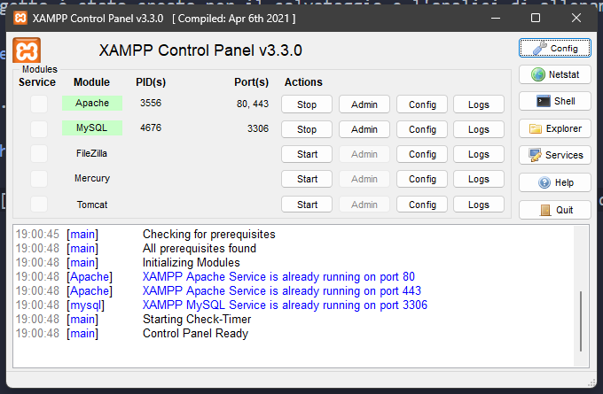

# Strava Statistics

Questo progetto è stato creato per il salvataggio e l'analisi di allenamenti postati su Strava, o allenamenti in generale.

## Utilizzo

Per utilizzare questo codice, bisogna prima di tutto avere un server PHP attivo sul computer. [XAMPP](https://www.apachefriends.org/it/index.html) è una scelta popolare e valida, questa guida presuppone che tu abbia già installato e configurato il servizio.

> [!NOTE]
> Il servizio XAMPP ha supporto nativo per sistemi Windows, Linux e MacOS

### Esecuzione del programma

Per prima cosa dobbiamo eseguire il programma. Per farlo, avviare il pannello di controllo XAMPP e cliccare sull'immagine "Shell".


Questo aprirà un prompt dei comandi.


A questo punto dobbiamo copiare il percorso **assoluto** del file index.php ed incollarlo nel comando seguente:

``` bash
php <percorso del file index.php>
```

che diventa, per esempio:

``` bash
php H:\xampp\htdocs\progetti\strava-statistics\index.php
```

### Sport supportati

Al momento, l'unico sport supportato è il nuoto. In futuro aggiungerò anche la bici e la corsa.

## Salvataggio e formattazione dei dati

Una volta finita l'immissione dei dati, il programma salverà automaticamente un file .json contenente i tempi migliori per, nel caso del nuoto, ciascuno stile. Chiederà poi se vogliamo anche formattare i dati. Questo passaggio può essere fatto in qualsiasi momento eseguendo il file `format_data`.

## Esempio di utilizzo

Quì mostro il funzionamento del programma con dati di un mio allenamento. Per semplicità, ho inserito i tempi di 3 giri casuali.

```
# php H:\xampp\htdocs\progetti\strava-statistics\index.php

Tool per l'analisi di attività Strava
Zerokelvin <zerokelvin.business@gmail.com>
Copyright: SAMT Lugano, sezione informatica

Inserisci lo sport dell'allenamento: nuoto
Quanti giri ha il tuo allenamento?: 3
Inserisci il nome dell'allenamento (Allenamento di nuoto): Allenamento del 20 ottobre 2025

Giro n.1
Che stile hai usato?: stile
Che distanza hai coperto?: 24.18
Inserisci una distanza valida.
Che distanza hai coperto?: 25
Quanto tempo ci hai impiegato in secondi?: 24.18
Il tempo per stile a 25m è cambiato a 24.18s.

Giro n.2
Che stile hai usato (stile)?:
Che distanza hai coperto (25)?: 50
Quanto tempo ci hai impiegato in secondi?: 51.04
Il tempo per stile a 50m è cambiato a 51.04s.

Giro n.3
Che stile hai usato (stile)?:
Che distanza hai coperto (50)?: 200
Quanto tempo ci hai impiegato in secondi?: 259.98
Il tempo per stile a 200m è cambiato a 259.98s.

Sto salvando i risultati...
Risultati salvati in results_1761503690.json con successo.
Vuoi formattare i dati elaborati e creare una tabella (Y/n):

Allenamento del 20 ottobre 2025         Sun, 26 Oct 2025 19:34:50


stile           tempo   passo

stile
  25m           24.18s  1'37"/100m
  50m           51.04s  1'42"/100m
  200m          259.98s 2'10"/100m

Grazie per aver usato questo tool, alla prossima!
```

## Versione

Versione 1.0

## Copyright

Crediti a [zerokelvin-000](https://github.com/zerokelvin-000). Tutti i diritti riservati.